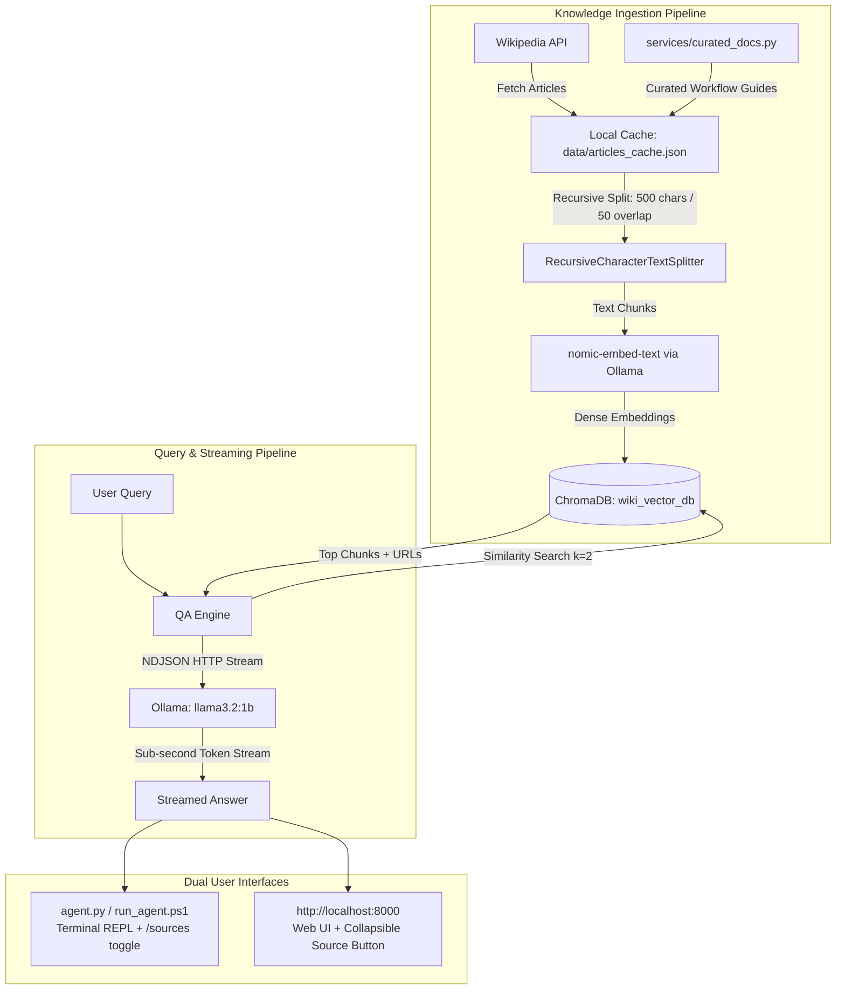

# 🧠 WikiAgent: Local Technical Knowledge RAG Chatbot & Agent

A 100% private, local, grounded Retrieval-Augmented Generation (RAG) conversational agent powered by **Ollama**, **LangChain**, **ChromaDB**, **Wikipedia-API**, and **Curated Engineering Workflows**. 

Supports both an interactive **Rich Terminal CLI Agent** (with hidden/collapsible citations) and a modern **FastAPI Web Chat Interface** (with interactive collapsible source buttons).

---

## 📌 Agent Classification & Architecture

* **Agent Type:** **Grounded Technical RAG Assistant**
* **Inference Model:** **Local Lightweight LLM** via Ollama (`llama3.2:1b` for 22+ tok/s CPU inference, with auto-fallback to `llama3:latest`)
* **Embedding Model:** **Dense Semantic Embedder** (`nomic-embed-text` - 768 dimensions)
* **Vector Store:** **ChromaDB** (Persistent SQLite + HNSW vector indexing)
* **Knowledge Corpus:** **37 Comprehensive Topics** (32 Wikipedia articles + 5 Curated Technical Workflow Guides)
* **Streaming Engine:** **Real-Time Token Streaming** via Ollama NDJSON HTTP stream with sub-second Time-to-First-Token (TTFT)
* **Offline Persistence:** **Local Disk Cache** (`data/articles_cache.json`) enabling 100% offline vector database rebuilds without internet dependencies
* **Offline Media Assets:** **Local Topic Image Store** (`data/images/`) serving topic thumbnails/badges directly in Web UI & CLI outputs

---

## 📚 Grounded Knowledge Base (37 Curated Topics)

The knowledge base spans 37 deep technical domains covering Software Engineering, AI, Web Stack, Security, and 3D Asset Pipelines:

```
├── 🐍 Core AI & Data Science
│   ├── Python (programming language)
│   ├── Machine learning
│   ├── Deep learning
│   ├── Natural language processing
│   ├── Artificial intelligence
│   ├── Neural network
│   ├── Large language model
│   └── Data science
├── 🌳 Data Structures & Algorithms (DSA)
│   ├── Data structure
│   ├── Algorithm
│   ├── Tree (data structure)
│   └── Graph (abstract data type)
├── 💾 Databases & Cloud Computing
│   ├── Database
│   ├── Relational database
│   ├── NoSQL
│   └── Cloud computing
├── 🤖 Advanced AI, RAG & Agents
│   ├── Retrieval-augmented generation (RAG)
│   ├── Intelligent agent
│   ├── Multi-agent system
│   └── Prompt engineering
├── 🛡️ Cybersecurity & Ethical Hacking
│   ├── Computer security
│   └── White hat (Ethical hacking)
├── 🌐 Web & Frontend Stack
│   ├── HTML
│   ├── CSS
│   ├── JavaScript
│   ├── React (software)
│   ├── Node.js
│   ├── Bootstrap (front-end framework)
│   └── Three.js
├── 🎨 UI / UX Design
│   ├── User interface design
│   └── User experience
├── 📐 Modern UI Frameworks & Architecture
│   ├── 21st.dev UI and Component Library
│   └── GetLayers and Layered Software Architecture
├── 🧊 3D Software & Simulation
│   ├── Blender (software)
│   └── Blender in Software Engineering and 3D Pipelines
└── 🚀 Development Lifecycles
    ├── Website Development Lifecycle and Step-by-Step Guide
    └── Application Development Lifecycle and Step-by-Step Guide
```

---

## 🏗️ System Architecture & Workflow



---

## 📂 Project Directory Structure

```
wiki_chatbot_api/
├── agent.py              # Interactive Terminal CLI Agent with Rich formatting
├── run_agent.ps1         # One-command PowerShell quick launcher
├── run_agent.bat         # One-click Windows CMD / Explorer launcher
├── main.py               # FastAPI application with CORS and route handlers
├── config.py             # Global configuration (Models, Threading, Chunks, Topics)
├── requirements.txt      # Locked dependency manifest
├── README.md             # Complete documentation and user guide
├── wiki_vector_db/       # Persistent local ChromaDB database (SQLite + HNSW vectors)
├── data/
│   └── articles_cache.json # Local offline cache of raw pre-gathered text articles
├── models/
│   └── schemas.py        # Pydantic schemas for REST API requests and responses
├── services/
│   ├── fetcher.py        # Rate-limit safe Wikipedia fetcher
│   ├── embedder.py       # Chunking, embeddings, and ChromaDB vector store
│   ├── qa_engine.py      # Direct streaming QA engine & Ollama LLM integration
│   └── curated_docs.py   # Specialized technical & workflow guides (21st.dev, Blender, SDLC)
└── routers/
    ├── ui.py             # Web UI HTML chat router with collapsible sources button
    ├── chat.py           # REST endpoints: POST /chat/, POST /chat/stream
    ├── topics.py         # REST endpoints: /topics/build, /topics/add, /topics/list
    └── status.py         # REST endpoints: GET /status/, GET /status/health
```

---

## 🚀 Prerequisites

1. **Python 3.9+** (Tested on Python 3.13)
2. **Ollama for Windows** installed and running.
3. Download the required models in a terminal:
   ```powershell
   ollama pull nomic-embed-text
   ollama pull llama3.2:1b
   ```

---

## ⚙️ Installation

```powershell
# 1. Navigate to project directory
cd C:\Users\91999\.gemini\antigravity\scratch\wiki_chatbot_api

# 2. Create virtual environment
python -m venv .venv

# 3. Install dependencies
.\.venv\Scripts\pip.exe install -r requirements.txt
```

---

## 🖥️ Mode 1: Interactive Terminal Agent (CLI)

The terminal agent runs directly in your PowerShell or Command Prompt with Rich styling and hidden citations by default.

### Launching:
```powershell
.\run_agent.ps1
```
*(Or run `.\.venv\Scripts\python.exe agent.py`, or double-click `run_agent.bat`)*

### Interactive Slash Commands:

| Command | Description | Example |
| :--- | :--- | :--- |
| **`your question`** | Ask any question or single keyword topic | `python` or `What is a binary search tree?` |
| **`/sources`** | View source citations for the last answer | `/sources` |
| **`/sources on`** | Toggle auto-showing sources after every answer | `/sources on` |
| **`/sources off`** | Keep sources hidden by default (clean terminal mode) | `/sources off` |
| **`/topics`** | List all currently indexed topics in vector store | `/topics` |
| **`/add <topic>`** | Fetch and index a custom Wikipedia article | `/add Quantum computing` |
| **`/search <query>`** | Search Wikipedia for article titles without indexing | `/search Neural network` |
| **`/build`** | Rebuild all 37 technical topics into ChromaDB | `/build` |
| **`/stats`** | View vector database statistics and Ollama model status | `/stats` |
| **`/clear`** | Clear the terminal screen | `/clear` |
| **`/help`** | Display available commands | `/help` |
| **`exit` / `quit`** | Exit the chatbot agent | `exit` |

---

## 🌐 Mode 2: Modern Web Chat Interface

If you prefer a browser-based chat with an interactive **collapsible source button**:

### Launching the Server:
```powershell
.\.venv\Scripts\python.exe -m uvicorn main:app --reload --port 8000
```

### Accessing the Web UI:
* **Web Chat App:** [http://localhost:8000](http://localhost:8000) (or `/app`)
* **Swagger API Docs:** [http://localhost:8000/docs](http://localhost:8000/docs)

### Web UI Highlights:
* **Collapsible `[ 📚 Sources (N) ▸ ]` Button**: Sources and URL links are hidden inside an accordion button under each bot message.
* **One-Click Topic Chips**: Clickable suggestion buttons (`🐍 Python`, `🌳 Data Structures`, `⚛️ React.js`, `🤖 AI Agents`, `🎨 21st.dev`, `🧊 Blender in Engineering`, `🚀 Website Steps`, `🛡️ Cybersecurity`).

---

## 🛠️ Configuration & Speed Tuning (`config.py`)

All parameters are pre-tuned for maximum CPU inference performance in [config.py](file:///C:/Users/91999/.gemini/antigravity/scratch/wiki_chatbot_api/config.py):

```python
class Config:
    OLLAMA_BASE_URL = "http://localhost:11434" # Ollama server address
    EMBED_MODEL = "nomic-embed-text"            # Embedding model (768-dim)
    LLM_MODEL = "llama3.2:1b"                   # Ultra-fast 1B model (22+ tok/s CPU)
    OLLAMA_KEEP_ALIVE = -1                      # Keep model resident in RAM
    OLLAMA_NUM_THREADS = 8                      # Multi-core CPU thread tuning
    OLLAMA_NUM_CTX = 1024                       # Bounded KV cache context window
    CHUNK_SIZE = 500                            # Maximum characters per text chunk
    CHUNK_OVERLAP = 50                          # Overlapping characters
    TOP_K_RESULTS = 2                           # Top chunks passed to LLM
    MAX_CONTEXT_CHARS = 1000                    # Maximum prompt context size
    LLM_NUM_PREDICT = 90                        # Bounded direct 1-3 sentence answers
```
